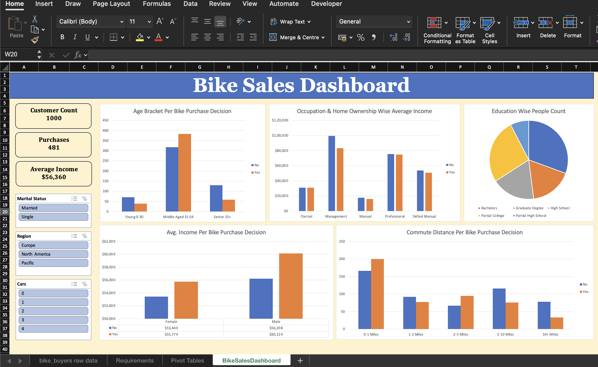

# 🚲 Bike Sales Dashboard | Microsoft Excel

## 📖 Project Overview

This project demonstrates how Microsoft Excel can be used as a Business Intelligence tool to transform raw customer data into meaningful business insights.

The project includes data cleaning, data transformation, Pivot Tables, Pivot Charts, interactive slicers, and dashboard development to analyze customer purchasing behavior for bike sales.

The dashboard enables users to filter and explore customer demographics, income distribution, commute distance, and purchasing decisions.

---

## 🎯 Business Problem

A bike manufacturing company wants to understand the characteristics of customers who are more likely to purchase bikes.

The objective is to analyze customer demographics and purchasing behavior to identify trends that can support data-driven marketing and sales decisions.

---

## 📊 Dashboard Features

The dashboard provides interactive insights on:

- 💰 Average Income vs Bike Purchase
- 🚻 Gender-wise Bike Purchase Analysis
- 🚶 Commute Distance vs Purchase Decision
- 👥 Age Bracket Distribution
- 🎓 Customer Education Analysis
- 🏠 Home Ownership & Occupation Analysis

### Interactive Filters

- Marital Status
- Region
- Education

---

## 🛠 Tools Used

- Microsoft Excel
- Pivot Tables
- Pivot Charts
- Slicers
- Data Cleaning
- Conditional Formatting
- Dashboard Design

---

## 📂 Project Workflow

### 1. Data Cleaning

Performed data preprocessing including:

- Removed duplicate records
- Checked for missing values
- Standardized categorical values
- Corrected inconsistent data entries
- Created Age Brackets for analysis

---

### 2. Data Analysis

Built Pivot Tables to generate business insights:

- Average Income by Gender and Bike Purchase
- Commute Distance by Purchase Decision
- Age Bracket Distribution
- Occupation & Home Ownership Average Income
- Education-wise Customer Count

---

### 3. Dashboard Development

Created an interactive dashboard using:

- Pivot Charts
- Slicers
- Dynamic filtering
- Professional layout
- KPI visualizations

---

## 📈 Key Insights

- Income has a noticeable impact on bike purchasing behavior.
- Middle-aged customers represent the highest number of bike buyers.
- Customers with shorter commute distances show higher purchasing tendencies.
- Purchasing patterns differ across gender and education levels.
- Home ownership and occupation influence average customer income.

---

## 📁 Files Included

```
Bike Sales Dashboard.xlsx
│
├── Raw Data
├── Data Cleaning
├── Pivot Tables
└── Interactive Dashboard
```

---

## 🚀 Skills Demonstrated

- Data Cleaning
- Data Transformation
- Data Analysis
- Pivot Tables
- Pivot Charts
- Interactive Dashboards
- Business Intelligence
- Data Visualization
- Excel Reporting
- Dashboard Design

---

## 📷 Dashboard Preview

```markdown

```

---

## 🎯 Learning Outcomes

Through this project, I strengthened my skills in:

- Cleaning and preparing raw datasets
- Building business reports in Excel
- Creating interactive dashboards
- Performing exploratory data analysis
- Presenting insights visually for business stakeholders

---

## ⭐ Business Value

This dashboard helps business users:

- Understand customer buying patterns
- Identify high-value customer segments
- Analyze demographic trends
- Support targeted marketing campaigns
- Make data-driven sales decisions

---

## 👩‍💻 Author

**Sunidhi Chaudhary**

Aspiring Data Analyst | Excel | SQL | Power BI | Python | Azure
